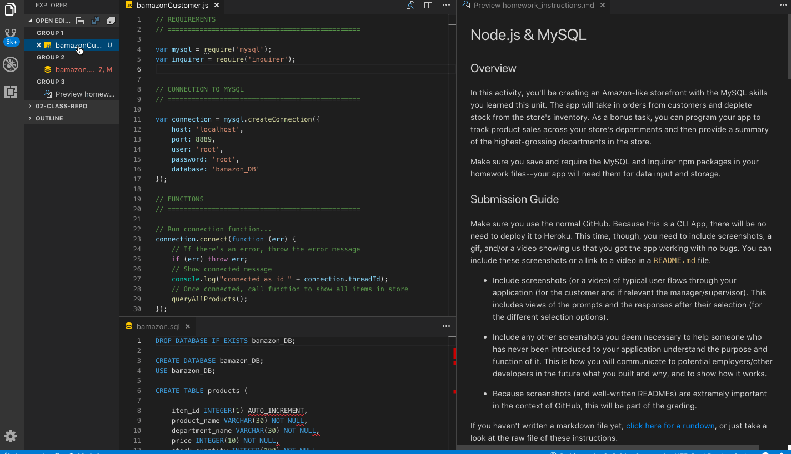

# Bamazon-HW

In this homework assignment, we created an Amazon-like application using NOde.JS and MySQL.

> Note from Cami: I was only able to complete the first challenge, but eventually would like to return to it and try the second and third.

## Overview
Within the terminal, a list of items for purchase will be available to the Hero. Our Hero will then be able to enter the **Item ID** and the **Quantity** of the item they wish to purchase.

# How To Use
1) Ensure the required packages are installed by typing `npm install` or you can install them individually `npm i mysql` and `npm i inquirer`
2) In the terminal, initiate the shop screen by typing in `node bamazonCustomer.js`
3) Once the shop is displayed you must first: **Enter ID#** of item you wish to purchase
4) Then you will be prompted to **Enter QUANTITY** of item you wish to purchase
5) A new shoplist will be displayed with the updated quantity

# User Flow Video
In the video below you will see a typical user flow that highlights the purchase process and includes an error example.

# Proof of HW Assignment
This is an additional video to showcase the functionality of the assignment and also to prove I really did it :)!

> Note from Cami: To whoever is reading this... HELLO and thanks for reading my ReadME :)